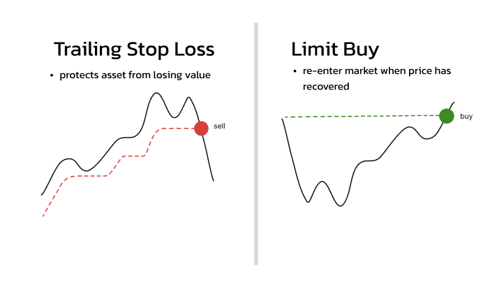
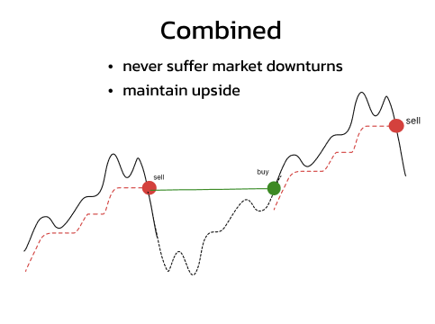
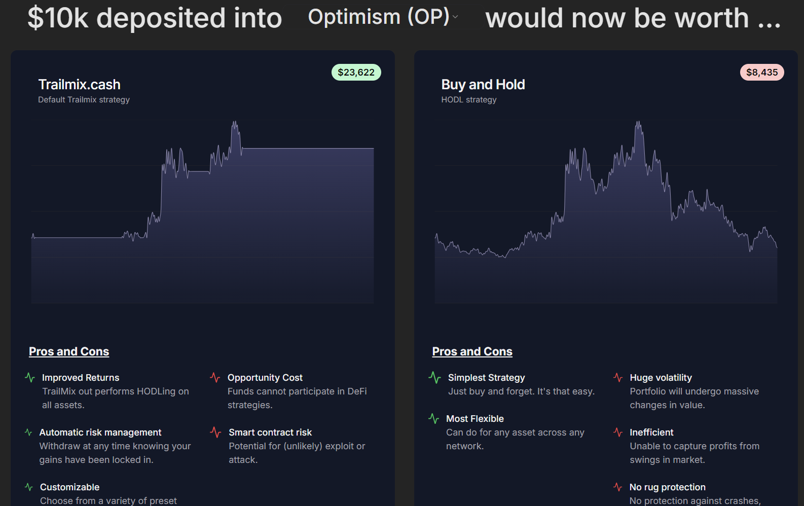

# 🏗 TrailMix-Loop

<h4 align="center">
  <a href="">Website</a>
</h4>

🧪 An open-source, automated risk management tool for your crypto assets.

⚙️ Built using NextJS, RainbowKit, Hardhat, Wagmi, Viem, and Typescript.

- ✅ **Any assset**: Choose any asset on Optimism with a Uniswap pool!
- 🔒 **Secure**: A new vault is deployed for each user! This means **no co-mingling** of user funds and full transparency at all times!
- ⏰ **Automated**: TrailMix manages your vaults so you don't have to (automation powered by [gelato network](https://www.gelato.network/web3-functions)). Just deposit and relax! TrailMix will protect you from losses 24/7 and re-enter the market so you maintain all the upside while limiting your risk.
- 💪 **Flexible**: Choose from a variety of configurations to make a vault that suits your needs.
- 🔗 **Onchain**: All logic is onchain and non-custodial. No need to trust 3rd parties (cough 3commas cough).
- 💸 **Free**: Because I'm too lazy to implement fees...

## Trading Strategy

Trailmix uses a trailing stop losses to know when to sell your assets. This can be thought of as a safety net that follows your asset as it rises and selling it when it begins to fall. TrailMix will then set a limit order to buy back in when the price reaches the same level.

This ensures that you never lose more than a specified percentage of your funds, while still giving you exposure to the upside. It may seem counter intuitive not to buy back in when the price is low but the issues is that the price can always go lower! It is a much safer bet to simply re enter your same position when the markets are healthier.

<p align="center">
  
</p>
<p align="center">
  
</p>

This ensures that you capture the general appreciation of an asset without having to hold through extended downturns. Your portfolio will always be near its all time high so you can withdraw without roundtripping your gains.

<p align="center">
  
</p>

Explore TrailMix backtesting [here](https://trailmix-backtest.vercel.app/)

## Requirements

Before you begin, you need to install the following tools:

- [Node (>= v18.17)](https://nodejs.org/en/download/)
- Yarn ([v1](https://classic.yarnpkg.com/en/docs/install/) or [v2+](https://yarnpkg.com/getting-started/install))
- [Git](https://git-scm.com/downloads)

## Quickstart (pulled from Scaffold-ETH 2)

To get started with Scaffold-ETH 2, follow the steps below:

1. Install dependencies if it was skipped in CLI:

```
cd my-dapp-example
yarn install
```

2. Add COIN_GECKO_API_KEY to your .env file in the nextjs directory. Add your DEPLOYER_PRIVATE_KEY to the .env file in the hardhat directory

3. Change into the nextjs directory and start your NextJS app:

```
cd packages/nextjs
yarn start
```

Visit your app on: `http://localhost:3000`. You can tweak the app config in `packages/nextjs/scaffold.config.ts`.

Deploy smart contracts by running `npx hardhat deploy --network optimism`
Verify your contract on optimistic etherscan by running `npx hardhat verify --network optimimsm CONTRACT_ADDRESS`

- Edit your smart contracts `TrailMix.sol or TrailMixManager.sol` in `packages/hardhat/contracts`
- Edit your deployment scripts in `packages/hardhat/deploy`
